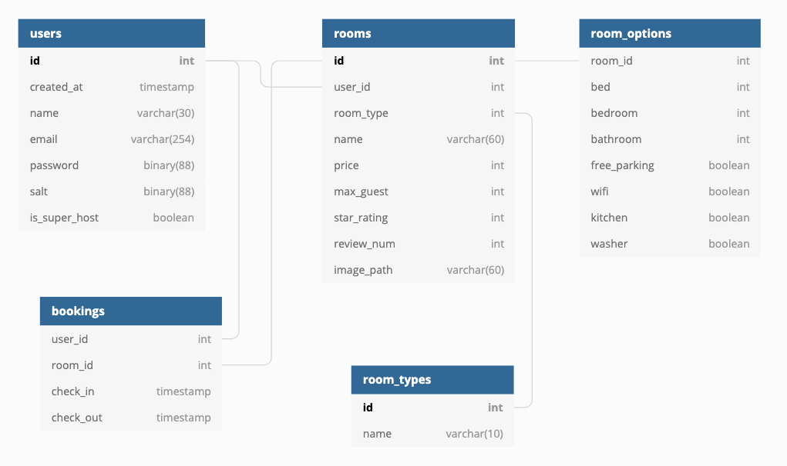

<h1 align="center">Boost bnb 👋</h1>
<p>
  
  <a href="https://github.com/YukJiSoo/umchan-server">
    
  </a>
</p>

## Insatll

1. React + NginX server docker image 생성 후 실행

```
cd react-app
docker build -t react-nginx-server .
docker run -it -p 8888:8888 react-nginx-server
```

2. GraphQL API server docker image 생성 후 실행

```
cd api-server
docker build -t graphql-api-server .
docker run -it -p 4000:4000 graphql-api-server
```

## Design

### DB table 구조


[Link](https://dbdiagram.io/d/5da49c13ff5115114db53be8)

## Author

👤 **Yuk Jisu**

-   Github: [@YukJiSoo](https://github.com/YukJiSoo)
