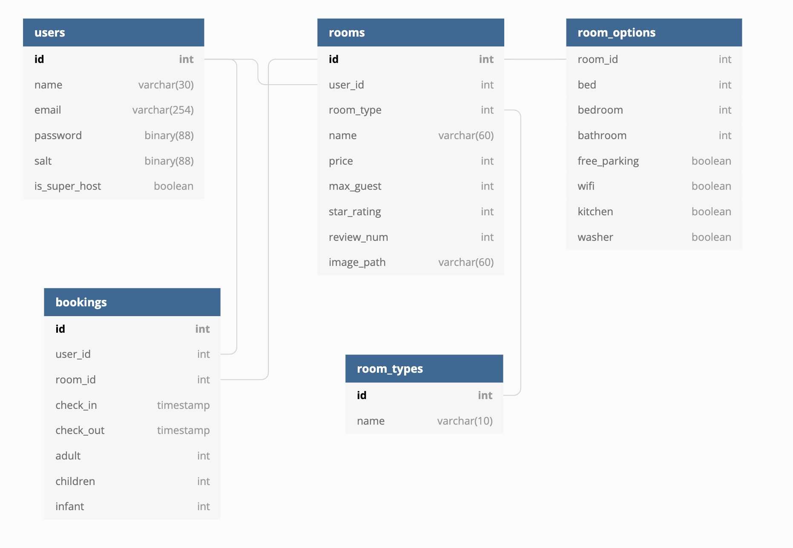

<h1 align="center">Boost bnb 👋</h1>

  
  

## Design
### DB table 구조

[Link](https://dbdiagram.io/d/5da49c13ff5115114db53be8)

## Author

👤 **Yuk Jisu**

* Github: [@YukJiSoo](https://github.com/YukJiSoo)
